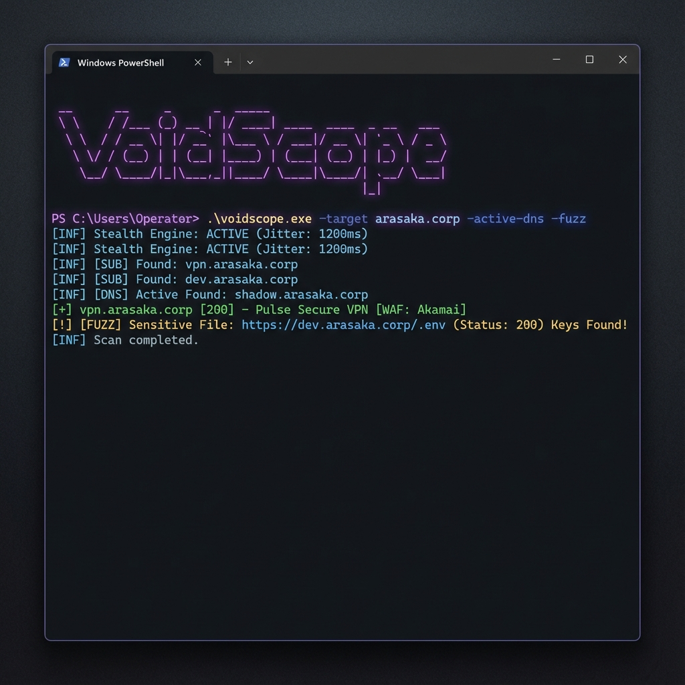

# VoidScope 🌑

> **The Swiss Army Knife for Modern Reconnaissance.**

  



I built **VoidScope** because I was tired of managing 10 different python scripts and 3 different binaries just to get a good picture of a target. I wanted something that could run on a VPS, handle `stdin` input, and specifically explicitly look for the things that actually matter in a Bug Bounty or Red Team context (like leaked secrets in JS or hidden dev domains).

It's written in Go, so it's a single binary. No pip install, no dependency hell.

---

## 🚀 Why Use This?

Most tools do *one* thing well. VoidScope tries to connect the dots.

*   **🔍 Subdomain Discovery**: It doesn't just check `crt.sh`. It actively bruteforces top 500 common subdomains (`dev`, `staging`, `vpn`) to find the stuff that isn't in public logs.
*   **🛡️ Stealth First**: Native SOCKS5 support. Route it through Tor (`127.0.0.1:9050`) or Burp Suite if you need to stay hidden.
*   **🤖 Smart Fingerprinting**: We don't just say "Port 80 Open". We grab the banner, check the WAF (Cloudflare/Akamai), and identify the tech stack.
*   **⚔️ Offensive**: Includes a **Fuzzer** that checks for `.env`, `.git`, and `backups`. Plus a **JS Scanner** that regex-matches AWS keys and API tokens.

---

## 📦 Installation

Since it's Go, you can just build it.

**Prerequisites:** Go 1.21+

### Windows
```powershell
git clone https://github.com/felinux0x/VoidScope.git
cd VoidScope
go build -o voidscope.exe ./cmd/voidscope
```

### Linux / Mac
```bash
git clone https://github.com/felinux0x/VoidScope.git
cd VoidScope
make build
```

---

## 📖 The Guide

### 1. The "Recon" Scan
Best for initial discovery. Finds subdomains, scans ports, and fingerprints web apps.

```bash
# Windows
.\voidscope.exe -target example.com

# Linux/Mac
./voidscope -target example.com
```

### 2. The "Hunter" Scan (Offensive)
This enables the **active** modules. It will make noise, but it finds vulns.
*   `-active-dns`: Tries to guess hidden subdomains.
*   `-fuzz`: Checks for sensitive files like `.env`.
*   `-js`: Downloads JavaScript and looks for secrets.
*   `-report`: Generates a `findings.html` file.

```bash
.\voidscope.exe -target example.com -active-dns -fuzz -js -report findings.html
```

### 3. The "Ghost" Scan (Stealth)
For when you need to be low-and-slow.
*   `-proxy`: Routes traffic through SOCKS5.
*   `-jitter-min 1000`: Waits at least 1s between requests.

```bash
.\voidscope.exe -target example.com -proxy socks5://127.0.0.1:9050 -jitter-min 1000 -jitter-max 5000
```

---

## ⚙️ Configuration

If you scan the same way often, use a `config.json` instead of typing flags every time.

```json
{
  "target": "example.com",
  "concurrency": 50,
  "proxy": "socks5://localhost:9050",
  "fuzz": true,
  "rate": 10
}
```

Run with: `./voidscope -config config.json`

---

## 📊 Modules Explained

| Module | What it does | Flag |
| :--- | :--- | :--- |
| **Subdomains** | Passive logs + Active Bruteforce | `-target`, `-active-dns` |
| **Ports** | TCP Connect + Banner Grabber | `-ports top100` |
| **Web Probe** | Status, Title, Tech Stack, WAF | (Automatic) |
| **Fuzzer** | Checks for sensitive files | `-fuzz` |
| **JS Intel** | AWS/API Key Scanner | `-js` |
| **Report** | Generates HTML Dashboard | `-report file.html` |

---

## 🤝 Contributing

Feel free to open a PR if you want to add more fingerprints or a new subdomain source. I tried to keep the code modular (`pkg/`) so it's easy to extend.

**Disclaimer**: This tool is for educational use and authorized testing only. 
